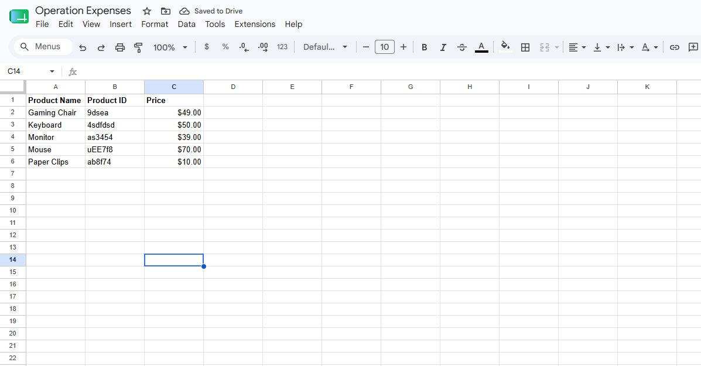
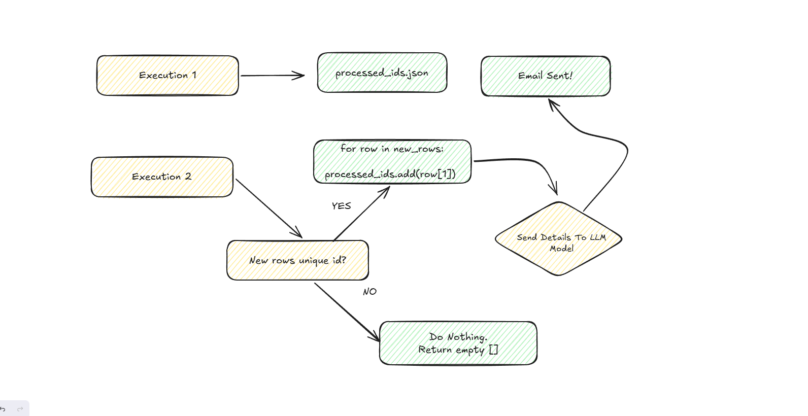
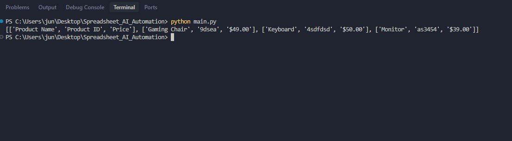

# Spreadsheet AI Automation

A Python starter project for reading data from a Google Spreadsheet using the Google Sheets API. It is set up to load credentials and spreadsheet settings from a local `.env` file.


## Requirements

- Python 3.10 or later
- A Google Cloud project with the Google Sheets API enabled
- A Google API key with access to the spreadsheet

## Setup

1. Create and activate a virtual environment.

   ```powershell
   python -m venv .venv
   .\.venv\Scripts\Activate.ps1
   ```

2. Install the dependencies.

   ```powershell
   pip install -r requirements.txt
   ```

3. Set up a Google API key in the [Google Cloud Console](https://console.cloud.google.com/):

   1. Create a new Google Cloud project, or select an existing project.
   2. Open **APIs & Services** > **Library**, search for **Google Sheets API**, and click **Enable**.
   3. Open **APIs & Services** > **Credentials**.
   4. Click **Create credentials** > **API key**, then copy the generated key.
   5. Restrict the key before using it outside local development. Under **API restrictions**, select **Restrict key** and allow the Google Sheets API.

   This project currently authenticates with an API key, so the spreadsheet must be readable without a Google sign-in (for example, share it as **Anyone with the link** with **Viewer** access). For private spreadsheets or write access, use OAuth 2.0 or a service account instead.

4. Create a `.env` file in the project root:

   ```env
   GOOGLE_API_KEY=your_google_api_key
   SPREADSHEET_ID=your_spreadsheet_id
   SHEET_NAME=Sheet1!A:Z
   ```

   `SHEET_NAME` is currently passed directly to the API as a range, so use A1 notation. The worksheet tab name is not the spreadsheet file title. For example, use `Sheet1!A:Z`, or `'Sales Sheets'!A:Z` when the tab name contains spaces.

5. Run the script.

   ```powershell
   python main.py
   ```

## Spreadsheet data requirements

The script detects new products by checking the **Product ID**. Every product must have a Product ID that is unique and does not change.

- Put the Product ID in the second **column** (column B), because the script reads `row[1]`.
- Do not place it in the second row—row 1 contains headers and rows 2 onward contain product data.
- Do not reuse a Product ID, even if an older product row is deleted.
- Keep the first row as the headers, for example: `Product Name`, `Product ID`, and `Price`.



The app stores successfully processed Product IDs in `processed_ids.json`. On later runs, only rows containing an ID that is not already in that file are returned as new rows.

## Workflow

On each execution, the app compares Product IDs from the spreadsheet with the IDs saved in `processed_ids.json`. If it finds new rows, it processes them, sends their details to the LLM workflow, and saves their IDs. If there are no new IDs, it returns an empty result and does nothing.



## Project structure

```text
.
|- main.py              # Fetches values from Google Sheets
|- requirements.txt     # Python dependencies
|- images/              # Project images
|- processed_ids.json   # Saved processed Product IDs (created at runtime)
`- .env                 # Local configuration (not committed)
```

## Screenshot



## Security

Never commit `.env` or share API keys. If a key is exposed, rotate it in Google Cloud and update your local `.env` file.
